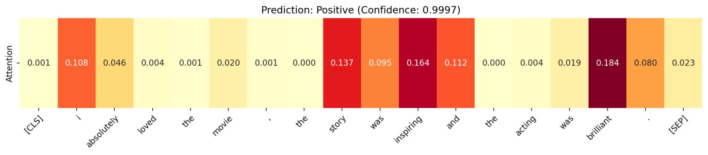
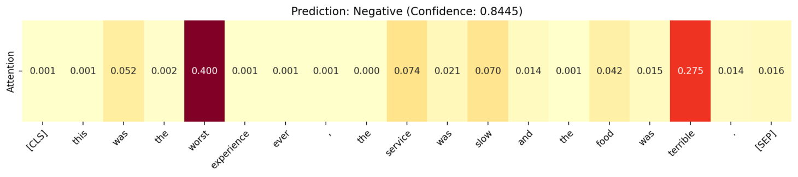

# Sentence Emotion Classifier With Attention

A simple, RNN-based sentence emotion classification model using attention mechanism.

_The heatmap showing the attention when processing a sentence that contains a positive emotion._

_The heatmap showing the attention when procesing a sentence that contains a negative emotion._

## Dataset

The dataset used in this project is the sst2 dataset, which is a collection of movie reviews labeled with sentiment. The dataset is available at [Stanford Sentiment Treebank](https://nlp.stanford.edu/sentiment/index.html).

## TODO

- [ ] Use separate loss function and optimizer for attention and RNN

- [ ] Implement Multi-Head Attention
- [ ] Experiment with transformer-based models
- [ ] Add residual
